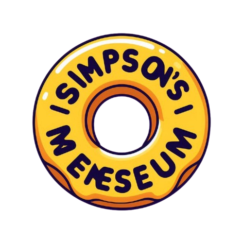
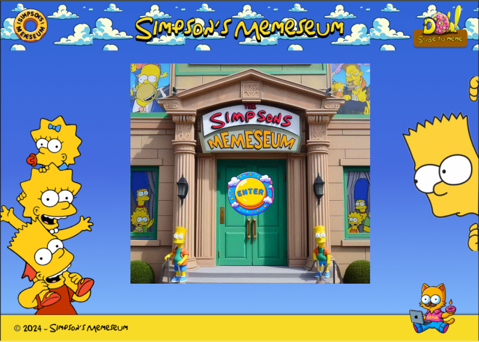
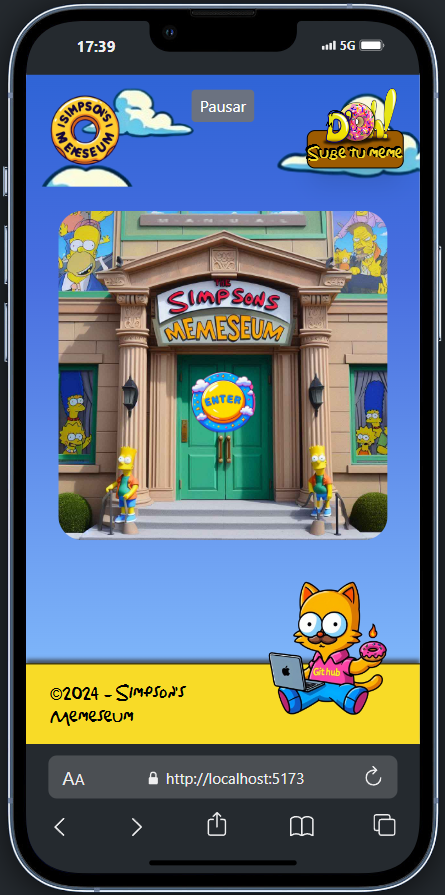

# Simpson's Memeseum

Simpson's Memeseum is a CRUD web application that serves as a virtual museum for memes inspired by The Simpsons. Users can browse through the memes, view them in a larger format, and interact with each meme by liking, disliking, editing, or deleting them. The project is built with React, utilizing json-server to simulate a backend for storing meme data. The user can also add new memes through a form, and there is a full CRUD interface allowing updates and deletions.

<div style="display:flex; flex-wrap: wrap; margin:0 auto;" align="center">
  <div style="margin-right:20px">
    <h3>Desktop version</h3>
    
  </div>
  <div>
    <h3>Mobile version</h3>
    
  </div>
</div>

## ✨ Features

- **Meme Gallery:** The full-gallery page displays all the memes as museum-like picture frames.

- **View Meme:** Clicking on a meme enlarges the image, allowing the user to see more details.

- **Like/Dislike System:** Users can interact with memes by giving them a "like" (❤️) or a "dislike" (💔). This interaction is session-based.

- **Create Meme:** Through the navigation bar, users can access a form to add new memes.

- **Edit Meme:** Clicking the "Edit" button on a meme will redirect the user to a form with the meme's data pre-filled, where they can modify the image or text.

- **Delete Meme:** Users can delete a meme entirely from the gallery.

- **Navigate Memes:** Users can easily navigate between memes using arrows to go forward or backward in the gallery.

- **Responsive Layout:** The layout of the app adjusts seamlessly to different screen sizes.

- **GitHub Button:** A button in the footer allows users to visit the project's GitHub repository.

## 🛠️ Tech Stack


- **React:** Frontend library for building the user interface.

- **Tailwind CSS:** Utility-first CSS framework used for styling the application.

- **json-server:** Provides a quick and easy way to create a fake REST API for handling the meme data.

- **React Router DOM:** Handles client-side routing to navigate between pages and components.

- **React-Hook-Form:** Used for managing forms in both meme creation and editing processes.

- **Axios:** Handles HTTP requests to interact with the json-server.

- **Vitest:** JavaScript testing framework used for unit testing the components.

- **Testing Library:** React testing utilities to test the behavior of the app's components.

## 🛠️💻 Project Setup

### 📝 Prerequisites

Ensure you have the following installed:

- Node.js (v16+)
- npm or yarn package manager

### ⚙️ Installation

1. Clone the repository:

```bash
git clone https://github.com/LorelizDev/simpsons-memeseum-project.git
```

2. Navigate to the project directory:

```bash
cd simpsons-memeseum-project
```

3. Install dependencies:

```bash
npm install
```

4. Start json-server:

```bash
npm run api
```
This will start the server for managing meme data, accessible at http://localhost:3000.

5. Run the React app:

```bash
npm run dev
```
The app should now be running on http://localhost:5173 or the specified port in your environment.

### 🧪 Running Tests

The project includes unit tests for key components using Vitest and @testing-library/react.

To run the tests:

```bash
npm run test
```

## 🗂️ File Structure

Simpson's Memeseum Project Structure:

```
/public
  └── Static assets (e.g., icons, etc.)

/server
  └── db.json      --> Simulated backend database using JSON-Server

/src
  ├── /assets
  │   ├── /images  --> Image assets used in the project
  │   └── /sounds  --> Sound files used in the project
  ├── /components
  │   ├── ButtonAddMeme.jsx  --> Button component for adding new memes
  │   ├── MemeView.jsx       --> Component for displaying memes in a detailed view
  |   ├── Footer.jsx         --> Footer with a link to GitHub repository
  │   └── ...
  ├── /layout
  │   └── Layout.jsx         --> General layout of the site (Navbar, Footer)
  ├── /pages
  │   ├── CreateMeme.jsx     --> Page for creating new memes
  │   ├── EditMeme.jsx       --> Page for editing existing memes
  │   ├── FullGallery.jsx    --> Page displaying the full gallery of memes
  │   ├── Gallery.jsx
  │   ├── Home.jsx
  │   └── Instructions.jsx
  ├── /router
  │   └── Router.jsx         --> Defines routes for navigation
  ├── /services
  │   └── services.js        --> API calls and service layer for interacting with JSON-Server
  ├── /tests
  │   ├── Footer.test.jsx    --> Unit tests for the Footer component
  │   ├── Form.test.jsx      --> Unit tests for the Form component
  │   ├── Navbar.test.jsx    --> Unit tests for the Navbar component
  │   └── setupTests.js      --> Setup for testing using Vitest
  └── main.jsx               --> Entry point of the React app
```

## 👥 Team

This project follows SCRUM methodology using Kanban to track progress.

- [**Lorena Acosta**](https://github.com/LorelizDev) - Scrum Master / Developer
- [**Arturo Mencía**](https://github.com/Arthurmm77) - Product Owner / Developer
- [**Juan Vázquez**](https://github.com/juanvprada) - Developer
- [**Omar Lengua**](https://github.com/Omarlsant) - Developer
- [**Violeta Flores**](https://github.com/Violeta-flores) - Developer

## 📅 Methodology

The team followed SCRUM practices for project management, including:

- **Daily stand-ups:** to ensure continuous communication.
- **Sprint planning:** for organizing tasks and setting priorities.
- **Retrospectives:** to assess and improve workflow after each sprint.

**Kanban** was used to visually manage the flow of tasks, ensuring that everyone had a clear understanding of what needed to be done, what was in progress, and what was completed.

## 🚀 Future Improvements:

1. **Pagination or Lazy Loading:**

- For the FullGallery page, implement pagination or lazy loading to handle large datasets of memes. This will improve performance and prevent long loading times as the meme collection grows.

2. **Testing Coverage:**

- Expand the unit tests to cover all major components. Include integration tests to ensure the interactions between components and API services are working as expected. Testing corner cases like invalid inputs and failed API calls would improve the overall reliability of the app.

3. **Animations and UX Enhancements:**

- Add more animations and transitions to improve the user experience. For example, a smoother transition when switching between memes or liking/disliking a meme.

4. **Database Enhancements (JSON-Server to Backend):**

- Eventually, consider moving from JSON-Server to a more robust backend solution (e.g., Node.js with a database like MongoDB or PostgreSQL) to support real-time updates, user authentication, and data persistence across sessions.

## ✉️ Contact

For any questions or issues, feel free to open an issue or contact any of the team members.